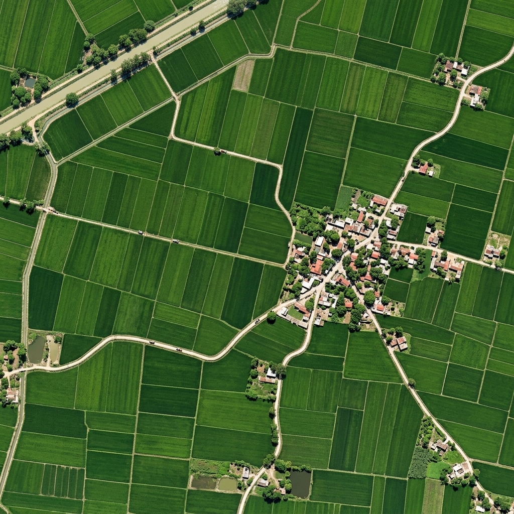

# Punjab Agri-Carbon Digital MRV & Tokenization Platform

<div align="center">



**Digital Business Transformation Strategies (DBTS) — Kharif 2025 Pilot**  
*Turning North Indian crop residue burning into high-durability Biochar, certified Puro.earth CORCs, and Direct Benefit Transfers (₹9,100/acre) for 500 smallholder farmers.*

[](https://vitejs.dev/)
[](https://react.dev/)
[](https://tailwindcss.com/)
[](https://www.european-biochar.org/)
[](https://puro.earth/)

</div>

---

## 🌾 Overview

The **Agri-Carbon Platform** provides a digital infrastructure solution for stopping paddy stubble burning in Punjab and Haryana. Through 25 mobile flame-curtain pyrolytic kilns across 5 regional clusters, the platform diverts 3,125 tonnes of paddy straw to produce 875 tonnes of high-durability biochar, sequestering **2,188 tCO2e (CORCs)** and distributing **₹1.138 Crore** directly into farmers' bank accounts.

---

## 🏛️ The 5 Integrated Applications

The platform connects 5 synchronized web interfaces accessible via a unified **Apps Drawer**:

```
                                    THE 5-STEP VALUE CHAIN
                                    
  [ 1. FARMER APP ]        [ 2. FIELD OPERATOR APP ]     [ 3. VERIFICATION CONSOLE ]
  • Enrolls 2.5 acres       • Weighs 125kg straw batches  • Eurofins tests H:Corg ≤ 0.4
  • Calculates ₹9,100/ac    • Runs 600°C+ pyrolysis kilns • Sentinel-2 scans zero-burn
  • Schedules mobile kiln   • Quenches with 150L water    • TÜV SÜD audits batch
         │                               │                               │
         ▼                               ▼                               ▼
  [ 5. COMMAND CENTER ]     ◄─────────────────────────     [ 4. BUYER PORTAL ]
  • PFMS direct bank DBT                                  • Puro.earth mints 2,188 CORCs
  • Disburses ₹1.138 Crore                                • Microsoft & Google offtake
  • Manages 33.5% P&L margin                              • CSRD ESG certificate export
```

### 1. Command Center (`/command-center`)
* **Users:** Project Leadership & Operations Team
* **Features:** 500-farmer registry, 25-kiln IoT telemetry status, Sentinel-2 zero-burn monitoring, corporate buyer agreements, and the **Pilot Financial Model & P&L Waterfall Bridge**.

### 2. Farmer / FPO App (`/farmer-app`)
* **Users:** Smallholder Farmers & Village FPO Leaders
* **Features:** Localized in **English**, **Hindi (हिंदी)**, and **Punjabi (ਪੰਜਾਬੀ)** with an **Interactive Land Area Calculator** (SVG farm polygon scaling, biomass yield, and instant ₹9,100/ac payout calculation).

### 3. Field Operator App (`/field-operator`)
* **Users:** Village Pyrolysis Coordinators
* **Features:** Straw intake scale, live 600°C+ thermocouple thermal monitoring, **Interactive 150L Water Quench** action with cooling curve, and QR bag sealing.

### 4. Buyer Portal (`/buyer-portal`)
* **Users:** Corporate Carbon Buyers (Microsoft, Google, Shopify, Swiss Re)
* **Features:** Entity switcher (€132–€155/t), **Official Carbon Removal Certificate Modal**, 5-step dMRV immutable custody timeline, and automated **CSRD / ESRS E1-7 ESG Exporter**.

### 5. Verification Console (`/verification`)
* **Users:** Independent Auditors (TÜV SÜD) & Compliance Officers
* **Features:** Paginated 625-batch immutable test ledger, Eurofins ISO 17025 LIMS chemistry feed ($H:\text{C}_{\text{org}} \le 0.40$), Sentinel-2 3-state plot compliance queue, and 1-click VVB audit ZIP export.

---

## 📊 Pilot Specifications (Kharif 2025)

| Metric | Specification | Meaning |
|---|:---:|---|
| **Enrolled Farmers** | **500** | 100 smallholders across each of 5 regional clusters |
| **Total Enrolled Area** | **1,250 Acres** | Average 2.5 acres per farmer |
| **Regional Hubs** | **5 Clusters** | Sangrur, Ludhiana, Karnal, Patiala, Kaithal |
| **Operating Kilns** | **25 Units** | Mobile Kon-Tiki Flame-Curtain Kilns (v2) |
| **Biomass Diverted** | **3,125 Tonnes** | 2.5 tonnes stubble per acre |
| **Biochar Produced** | **875 Tonnes** | 28.0% pyrolytic conversion yield |
| **Biochar Returned** | **0.7 t / Acre** | Applied back to fields to improve soil organic carbon |
| **Carbon Credits** | **2,188 CORCs** | 100+ year permanent mineral carbon storage ($H:\text{C}_{\text{org}} \le 0.40$) |
| **Direct Benefit Transfer**| **₹9,100 / Acre** | Direct bank transfer (₹1.138 Crore total pool disbursed via PFMS) |
| **Platform Revenue** | **₹44.75 Lakh** | Carbon credit margin & technology fee (€140/t average realization) |
| **Operating Costs** | **₹29.75 Lakh** | Field operations, kilns, dMRV software, registry & lab fees |
| **Net Platform Margin** | **₹15.00 Lakh** | **33.5% Net EBITDA Margin** |

---

## 🚀 Getting Started

### Prerequisites
* Node.js (v18+)
* npm

### Installation & Run
```bash
# Clone repository
git clone <YOUR_REPO_URL>
cd agri-carbon-platform

# Install dependencies
npm install

# Launch development server
npm run dev
```

Visit `http://localhost:5173/` in your browser.

### Production Build
```bash
npm run build
```

---

## 📄 Documentation

For the complete plain-English master guide and detailed mathematical breakdown, refer to [`docs/Agri_Carbon_Platform_Complete_Guide.docx`](docs/Agri_Carbon_Platform_Complete_Guide.docx).

---

## 👤 Author
* **Archit Sarkar** (2025PGP141) — Digital Business Transformation Strategies (DBTS)
